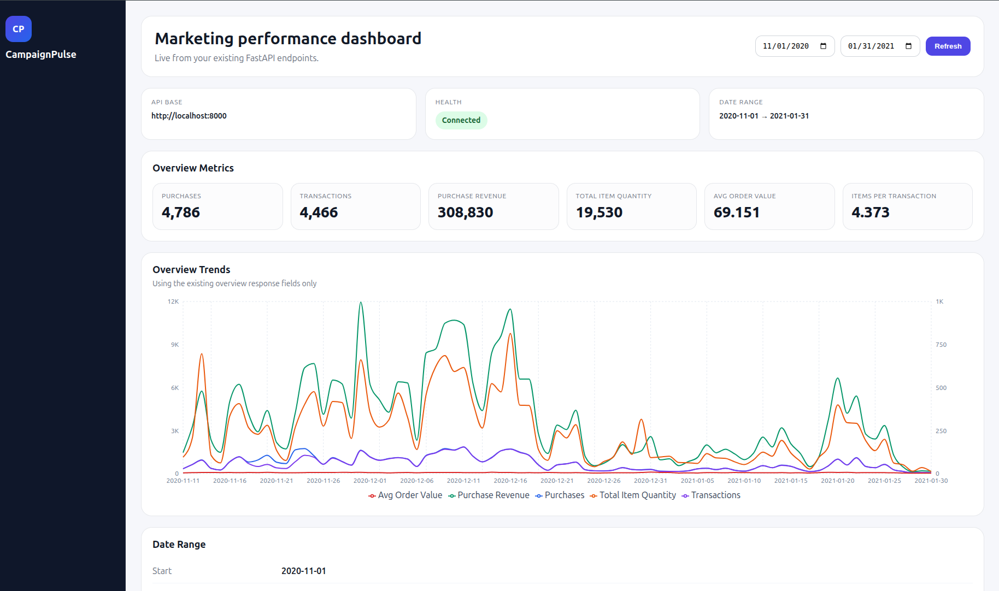

# Google Cloud Data Project

<p align="center">
  
</p>


A small end-to-end analytics project built on Google Cloud and BigQuery using the public GA4 sample ecommerce dataset. The project stages raw event data, builds marts for reporting, and exposes results through a local API for dashboard-style consumption.

## Features

- BigQuery-based staging and marts workflow
- SQL models for:
  - `stg_events_core`
  - `stg_ecommerce_events`
  - `mart_daily_overview`
  - `mart_funnel_daily`
- Local backend API for analytics queries
- Rebuild scripts for repeatable SQL execution

## Project structure

```text
scripts/
  dry_run_sql.sh
  run_sql.sh

sql/
  staging/
    stg_events_core.sql
    stg_ecommerce_events.sql
  marts/
    mart_daily_overview.sql
    mart_funnel_daily.sql
```

## Data source

This project uses the public Google BigQuery dataset:

- `bigquery-public-data.ga4_obfuscated_sample_ecommerce`

## Prerequisites

- Google Cloud SDK
- BigQuery CLI (`bq`)
- Access to a Google Cloud project with BigQuery API enabled
- A local backend environment for serving the API

## Setup

1. Authenticate locally:
   ```bash
   gcloud auth application-default login
   ```

2. Enable BigQuery:
   ```bash
   gcloud services enable bigquery.googleapis.com
   ```

3. Create datasets:
   ```bash
   bq --location=US mk --dataset YOUR_PROJECT_ID:staging
   bq --location=US mk --dataset YOUR_PROJECT_ID:marts
   ```

## Build the models

Run the SQL models in dependency order:

```bash
GOOGLE_CLOUD_PROJECT=YOUR_PROJECT_ID \
bash scripts/run_sql.sh sql/staging/stg_events_core.sql

GOOGLE_CLOUD_PROJECT=YOUR_PROJECT_ID \
bash scripts/run_sql.sh sql/staging/stg_ecommerce_events.sql

GOOGLE_CLOUD_PROJECT=YOUR_PROJECT_ID \
bash scripts/run_sql.sh sql/marts/mart_daily_overview.sql

GOOGLE_CLOUD_PROJECT=YOUR_PROJECT_ID \
bash scripts/run_sql.sh sql/marts/mart_funnel_daily.sql
```

## Validate

Example API check:

```bash
curl -i "http://localhost:8000/api/overview?start=2020-11-01&end=2021-01-31"
```

## Notes

- Do not commit credentials, access tokens, ADC files, or local configuration.
- Keep project-specific values configurable through environment variables.
- This repository is intended to show project structure, SQL modeling, and BigQuery workflow rather than private cloud credentials.
